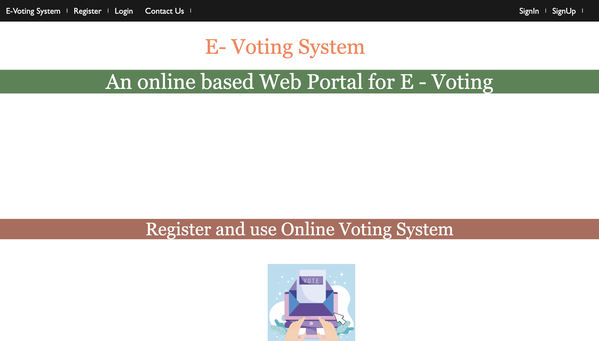

# Online-Voting-System
The objective of this project is to develop an online voting system that allows users to cast their vote from anywhere in the world with an internet connection. This system will provide a secure, transparent, and efficient way for people to participate in elections, surveys, and other voting events. The system will be designed to ensure that only authorized users can access it and that their votes are counted accurately and securely.

# Description
The online voting system project will be implemented using HTML, CSS, and other web technologies. The system will have a user-friendly interface that allows users to register, log in, and cast their votes. The system will have different levels of access for different users, including administrators and voters.

The system will allow administrators to create and manage polls, add candidates, and set rules for voting. The system will also allow voters to view the available polls, select their preferred candidate, and submit their votes securely. The system will have a mechanism to ensure that each voter can only cast one vote and that their vote is anonymous and confidential.

Overall, the online voting system project will provide an easy-to-use and reliable platform for people to participate in voting events, making the process more accessible, transparent, and secure.

# Website 

![EVoting1] (EVoting1.png)

# SignUP
![Login] (SignUp.pmg)
